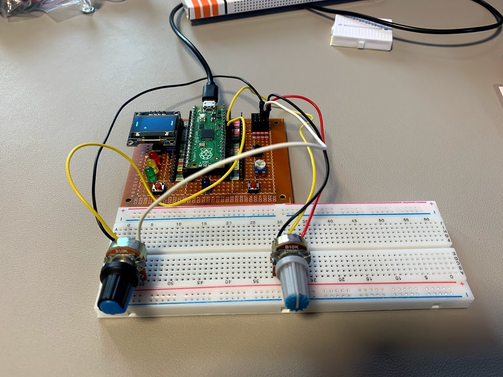

# Pico-Pong-2021
My pong clone on Raspberry Pi Pico

Author: Jerzy Jasonek

This is a Pong MicroPython clone on the Raspberry Pi Pico.

Install ssd1306 and framebuf into the lib folder.

Player 1 controller - GP26
Player 2 controller - GP27

Start button - GP15
Select level button GP14 

Select training mode - 1 player mode - scroll max left player 2 controller on start screen to turn on training mode

In the two-player mode, the winner is the first player to score 15 points.

The single player mode (player 2) is played for points. You get points for every bounce * level. The game ends when you miss 15 balls.

Project description in Polish: [Markdown - Link](#http://jerzy.jasonek.pl/blog/Projekt-Pico-Pong-2021)
